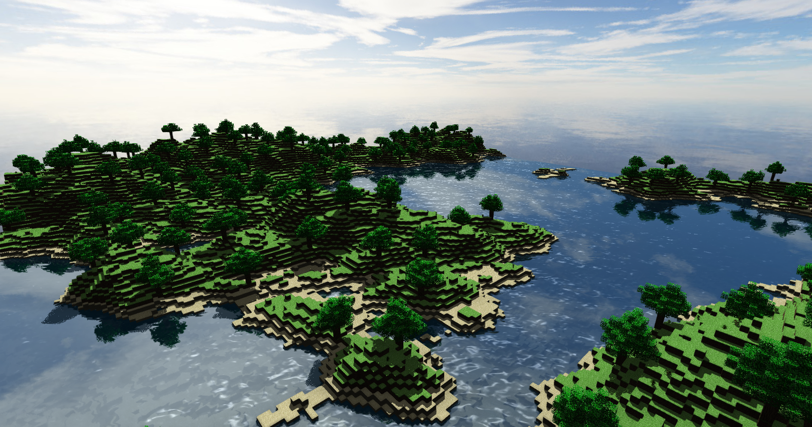
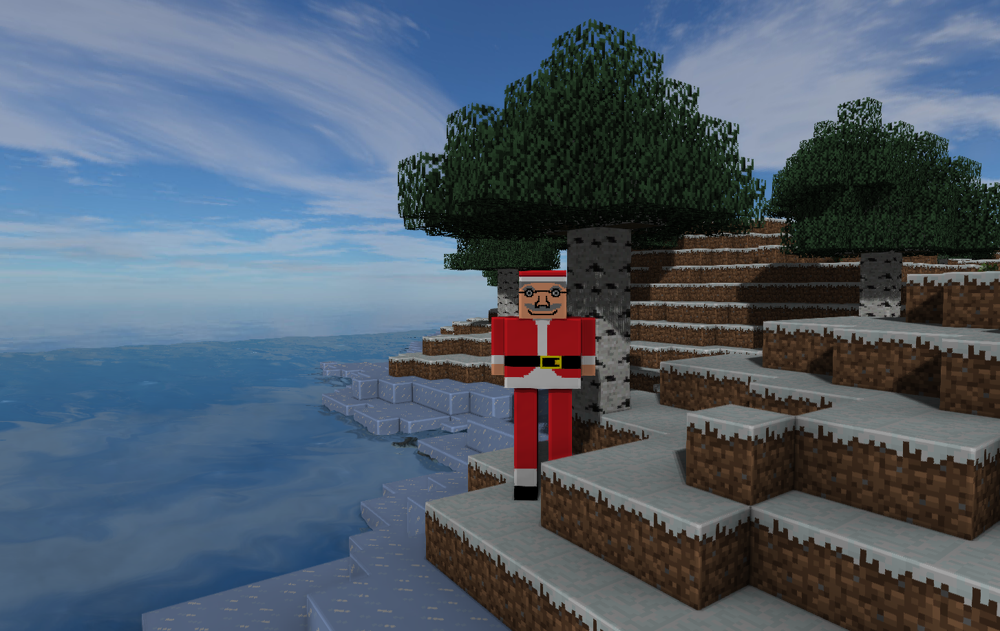

## CubeExplorer
Minecraft-like game for the course TSBK03 at Linköping University

#Features
* Procedural world-generation
* Chunk-mesh rendering on 16x16x16 blocks
* Procedural ocean simulation with Compute Shaders (based on the works of https://github.com/fynnfluegge/oreon-engine)
* Cascaded shadow maps
* Screen space ambient occlusion
* FXAA

#Dependencies
* GLFW
* GLM
* Nanovg
* simple_fft 
* GLAD (on Windows)

